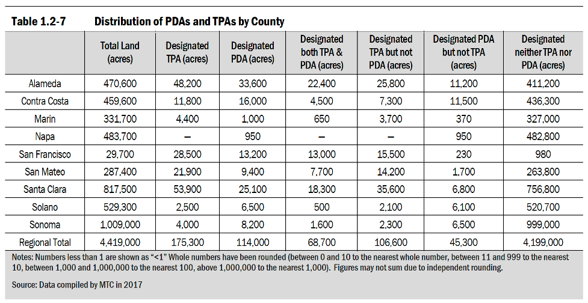

# Environmental Impact Report Plan Bay Area 2050
The purpose of this repository is to document all data work and processes in support of the Environmental Impact Report (EIR) for Plan Bay Area 2050. 

## Project Management 

Add links to:
- [Asana Project](https://app.asana.com/0/229355710745434/1189349851128091)
- [EIR Box Directory (Internal Access Only)](https://mtcdrive.box.com/s/bebknhfq4nzhot2vf6mioq36gobxhw8a)

## Table of Contents 

- [EIR Plan Bay Area 2040](PBA2040_EIR.md)
- [Data Sources](#data-sources)
	- [Growth Geography Summary Sources](#growth-geography-summary-sources)
- [Analysis Parameters](#analysis-parameters)
	- [Growth Geography Summary Parameters](#growth-geography-summary-parameters)
- [Methodology](#methodology)
	- [Growth Geography Summary Methods](#growth-geography-summary-methods)
- [Expected Outcomes](#expected-outcomes)
- [Results](#results)

## Data Sources

### Growth Geography Summary Sources

- [Plan Bay Area 2050 Growth Geographies (Internal Access Only)](https://arcgis.ad.mtc.ca.gov/portal/home/item.html?id=3922afc70d3a4475a98e6ae9973f2bfb)
- [Transit Priority Areas (Not yet linked)]()

## Analysis Parameters

### Growth Geography Summary Parameters

Summarize growth geographies following the example table below. Use Plan Bay Area 2050 growth geographies instead of PDAs. Growth Geographies data should be treated as an aggregate, dissolved geographic area. 

## Methodology

### Growth Geography Summary Methods

## Expected Outcomes

## Results